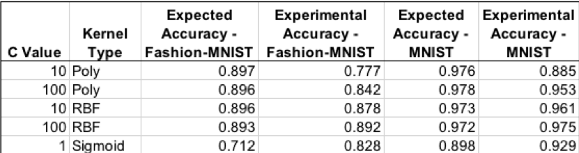
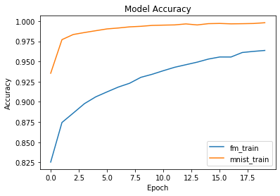
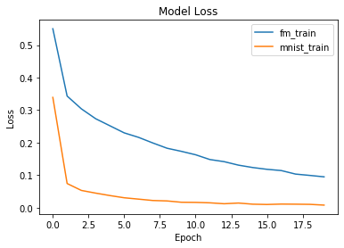
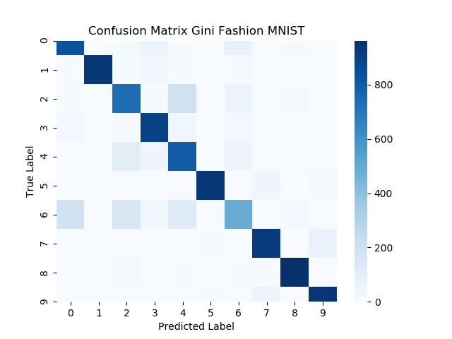
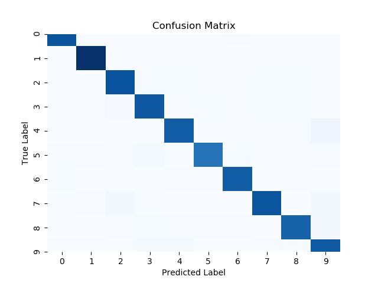

### Introduction

The authors of “Fashion-MNIST: a Novel Image Dataset for Benchmarking Machine Learning Algorithms” set out to create a dataset to rival the most widely used public dataset for machine learning, the MNIST dataset. They believe that the MNIST dataset, which is comprised of 7,000 pre-processed images of handwritten digits, is too simple of a machine learning task as accuracies of 99.7% can now be achieved. The Fashion-MNIST dataset is unique as it contains the same number of examples with the same image format along with the same number of possible classes as the MNIST dataset. Therefore, this new dataset can be easily integrated into any machine learning framework as most already support MNIST with included helper functions and examples. The paper to be investigated proves that the Fashion-MNIST dataset is more of a challenge to classify than the original MNIST dataset, achieving a maximum test accuracy of 89.7%. To do so, the authors present a number of machine learning algorithms, each with multiple examples using different parameter values, and present an average testing accuracy over 5 trials of randomly shuffled data for each classifier. The results are also compared to the corresponding benchmark accuracies for the MNIST dataset.

# Model

#### SVM
Xiao et al showed that out of all the classifiers they explored using the Fashion-MNIST dataset, support vector classifiers (SVCs) were able to obtain the highest accuracy. By changing the regularization parameter, C, and the type of kernel used, accuracies from 70.3% to 89.7% were reported for the Fashion-MNIST dataset. Because this type of classifier was shown by Xiao et al to be the most accurate when applied to the Fashion-MNIST dataset, it is important to attempt to reproduce the results using SVCs to validate the authors’ claim. An evaluation of the accuracy of the SVCs will also be done using the original MNIST dataset to determine the difference in difficulty of classification between the two datasets. 
 
##### Procedure 
* Import MNIST and Fashion-MNIST datasets using the Keras deep learning library
* Reshape, shuffle, and split the data sets to allow for input into an SVC. 60,000 examples will be used in the training set while the remaining 10,000 will be used for testing.
* Normalize the intensity values of the images to [0,1] by dividing each value by 255, the maximum intensity value.
* Create an SVC for each dataset using the scikit-learn library, specifying C and kernel type with an “auto” gamma value.
* Fit the SVC models to the training data for each dataset respectively. 
* Compute the accuracy of the trained models on the data set aside for testing. 
* Repeat above steps for the top 4 performing parameters as well as the worst performing parameters given by the author. 
 
These steps can be seen and executed using [this notebook](MNIST_FASHION_SVM.ipynb).
 
### Results

 
The table above shows the average results of two trials of each SVC and the parameters specified for each model. It can be noted that every experimental trial except for the sigmoid example is less accurate than the expected results from Xiao et al. This could be due to the authors specifying different parameters that were not published or a difference in version number of libraries being used. However, the worst performing SVC as indicated by Xiao et al showed better performance in our implementation.  The best performing model from Xiao et al used a C value of 10 and a polynomial kernel. However this turned out to be the worst performing model in our experimental trials. For our implementation, the most accurate SVC had a C value of 100 and used a radial basis function kernel to achieve 89.2% accuracy on the Fashion-MNIST dataset, just 0.5% less than the most accurate SVC results from Xiao et al. 
 
### Discussion
Looking deeper into the data shared on the author’s gitHub repository, it was discovered that the SVC results shown were the average of only two executions of each set of parameters, originally stated as the average of 5 trials. This is most likely due to the long training times for the SVCs. The training times for an SVC on the Fashion-MNIST dataset ranged from 56 minutes up to 50 hours, with a median of around one hour and fifteen minutes. Because an SVM model is a quadratic programming problem at its core, the training time will scale with the cube of the number of training vectors (O(k3)) as discussed by H.P. Graf et al. These long training times are expected and also why others, such as H.P. Graf et al, are searching for ways to speed up the training of SVMs. Because of this, the results were limited to 2 trails for each model as training time on the machine used was generally consistent with the median of the results given by Xiao et al. 
 
Overall, the SVC implementation of the Fashion-MNIST dataset was successful with some discrepancies in the variation of the results with respect to the set parameters. However, the created SVC was able to attain a maximum accuracy of 89.2% on  the Fashion-MNIST dataset. Also, it was proven that the Fashion-MNIST was more of a challenge for SVCs as each model created was 9.72% more accurate on average when trained on the original MNIST dataset. 

#### CNN
Given that the original authors, Xiao et al, never tested against any deep learning models, we decided this would be the perfect opportunity to test the core hypothesis of the paper. Convolutional neural networks (CNN) are well poised to tackle image classification problems such as Fashion-MNIST & MNIST. For the sake of simplicity, we made use of Tensorflow’s Keras package to import both datasets and build the LeNet-5 CNN architecture.

##### Procedure
* Import MNIST and Fashion-MNIST datasets
* Reshape and pad the data such that each sample can be properly passed to the CNN.
* Build and compile a LeNet-5 CNN for both datasets
* Train each model for 20 epochs while using 10% of the training data in validation split
* Evaluate each model

For a more in-depth look at how these steps were accomplished, feel free to take a look at our [interactive notebook](AdvML_LeNet5_test.ipynb).

##### Results
We made use of a 75/10/15 split for training, validation, and testing respectively.  After training each model for 20 epochs, we were able to achieve the following accuracies:

* Fashion-MNIST:
  * Test accuracy - 88.96%
  * Training accuracy - 96.37%
  * Validation accuracy - 89.97%
* MNIST:
  * Test accuracy - 98.83%
  * Training accuracy - 99.80%
  * Validation accuracy - 98.92%

From the above results, we see that the model performs worse on the Fashion-MNIST dataset than it does on the MNIST dataset. This confirms our hypothesis in which the CNN would do worse on Fashion MNIST. Our results also illustrate that neither model has overfit the data due to the relatively high validation accuracy in comparison to their respective test set accuracies.

#### Random Forest
In order to replicate the papers parameters for random forest we use a prebuilt Random Forest classifier from sklearn. We changed to corresponding parameters with the authors of the original paper.

##### Procedure
* Import MNIST and Fashion Mnist and pre-process data with numpy
* Train Random Forest with different parameters as seen in Table 1
* Test and Train model with Sklearn Ensemble
* Use Sklearn Accuracy_Score to evaluate performance

##### Results
 We ran each test five times and took an average of the accuracy of the model our results are show in Table 1 (WILL CREATE TABLE AND INSERT A TABLE):

|	n_estimater | depth | criterion | acc MNIST Fashion | MNIST|
|       --- | --- | --- | --- | --- |
|	     100    |  100  | gini      | 0.87582           | 0.9683|
|             100    |  50   | gini      | 0.87686           | 0.9696|
|             10     |  50   | gini      | 0.85342           | 0.9486|
|             100    |  10   | gini      | 0.84352           | 0.94858|
|             100    |  10   | entropy   | 0.84564           | 0.94999|
|             10     |  50   | entropy   | 0.85666           | 0.94878|
|             100    |  50   | entropy   | 0.877             | 0.9688|
|             100    |  100  | entropy   | 0.8775            | 0.9709|
Table 1

We also visualized some methods with a confusion matrix to visually represent the models performance.

| Label | Description |
| --- | --- |
| 0 | T-shirt/top |
| 1 | Trouser |
| 2 | Pullover |
| 3 | Dress |
| 4 | Coat |
| 5 | Sandal |
| 6 | Shirt |
| 7 | Sneaker |
| 8 | Bag |
| 9 | Ankle boot |

# Discussion

# Conclusion
