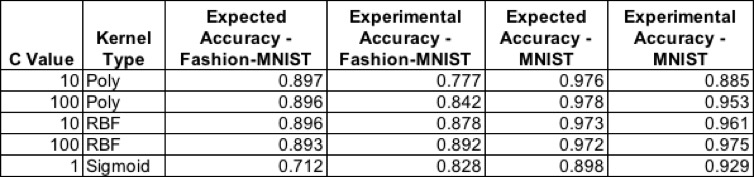

### Introduction

The authors of “Fashion-MNIST: a Novel Image Dataset for Benchmarking Machine Learning Algorithms” set out to create a dataset to rival the most widely used public dataset for machine learning, the MNIST dataset. They believe that the MNIST dataset, which is comprised of 7,000 pre-processed images of handwritten digits, is too simple of a machine learning task as accuracies of 99.7% can now be achieved. The Fashion-MNIST dataset is unique as it contains the same number of examples with the same image format along with the same number of possible classes as the MNIST dataset. Therefore, this new dataset can be easily integrated into any machine learning framework as most already support MNIST with included helper functions and examples. The paper to be investigated proves that the Fashion-MNIST dataset is more of a challenge to classify than the original MNIST dataset, achieving a maximum test accuracy of 89.7%. To do so, the authors present a number of machine learning algorithms, each with multiple examples using different parameter values, and present an average testing accuracy over 5 trials of randomly shuffled data for each classifier. The results are also compared to the corresponding benchmark accuracies for the MNIST dataset.

# Models

#### SVM
Xiao et al showed that out of all the classifiers they explored using the Fashion-MNIST dataset, support vector classifiers (SVCs) were able to obtain the highest accuracy. By changing the regularization parameter, C, and the type of kernel used, accuracies from 70.3% to 89.7% were reported for the Fashion-MNIST dataset. Because this type of classifier was shown by Xiao et al to be the most accurate when applied to the Fashion-MNIST dataset, it is important to attempt to reproduce the results to validate the authors’ claim. An evaluation of the accuracy of the SVCs will also be done using the original MNIST dataset to determine the difference in difficulty of classification between the two datasets. 
 
##### Procedure 
* Import MNIST and Fashion-MNIST datasets using the Keras deep learning library
* Reshape, shuffle, and split the data sets to allow for input into an SVC. 60,000 examples will be used in the training set while the remaining 10,000 will be used for testing.
* Normalize the intensity values of the images to [0,1] by dividing each value by 255, the maximum intensity value.
* Create an SVC for each dataset using the scikit-learn library, specifying C and kernel type with an “auto” gamma value.
* Fit the SVC models to the training data for each dataset respectively. 
* Compute the accuracy of the trained models using the portion of the dataset set aside for testing. 
* Repeat the above steps for the top 4 performing parameters as well as the worst performing parameters of the SVC given by the author. 
 
These steps can be seen and executed using [this notebook](MNIST_FASHION_SVM.ipynb).
 
##### Results

 
The table above shows the average results of two trials of each SVC and the parameters specified for each model for both the experimental and published (expected) results. It can be noted that every experimental trial except for the sigmoid example is less accurate than the expected results from [3], with an average decrease in accuracy of 4.8% and 3.1% for the Fashion-MNIST and MNIST datasets, respectively. This could be due to the authors specifying different parameters that were not published or a difference in version number of libraries utilized. However, the worst performing SVC as indicated by Xiao et al showed better performance in our implementation.  The best performing model from Xiao et al used a C value of 10 and a polynomial kernel. However, this turned out to be the worst performing model in our experimental trials. For our implementation, the most accurate SVC had a C value of 100 and used a radial basis function kernel to achieve 89.2% accuracy on the Fashion-MNIST dataset, just 0.5% less than the most accurate SVC results from Xiao et al. 
 
##### Discussion
Looking deeper into the data shared on the author’s GitHub repository, it was discovered that the SVC results shown were the average of only two executions of each set of parameters, originally stated as the average of 5 trials in [3]. This is most likely due to the long training times for the SVCs. The training times for an SVC on the Fashion-MNIST dataset ranged from 56 minutes up to 50 hours, with a median of around one hour and fifteen minutes. Because an SVM model is a quadratic programming problem at its core, the training time will scale with the cube of the number of training vectors (O(k3)) as discussed by H.P. Graf et al. These long training times are expected and also why others, such as H.P. Graf et al, are searching for ways to speed up the training of SVMs. Because of this, the results were limited to 2 trials for each model as training time on the machine used was generally consistent with the median of the results given by Xiao et al. 
 
Overall, the SVC implementation results by Xiao et al of the Fashion-MNIST dataset was successfully recreated with only some discrepancies in the variation of the results with respect to the set parameters. However, the created SVC was able to attain a maximum accuracy of 89.2% on  the Fashion-MNIST dataset. Also, it was proven that the Fashion-MNIST was more of a challenge for SVCs as each model created was 9.72% more accurate on average when trained on the original MNIST dataset. 

#### CNN
Given that the original authors, Xiao et al, never tested against any deep learning models, we decided this would be the perfect opportunity to test the core hypothesis of the paper. Convolutional neural networks (CNN) are well-posed to tackle image classification problems such as Fashion-MNIST & MNIST. For example, if you were to take a look at any of the top performing algorithms on CIFAR-100 or the ImageNet challenge, you would see some form of CNN.[6] However, even with all the many upsides of using CNNs for image classification, there is a cost to pay in regards to training time. To circumvent this hurdle, we made use of the Google Collaboratory platform to train and evaluate our model to avoid long training times due to the fact that they provide free GPU and TPU resources. We made use of Tensorflow’s Keras package to import both datasets and build the LeNet-5 CNN architecture.

##### Procedure
* Import MNIST and Fashion-MNIST datasets
* Reshape and pad the data such that each sample can be properly passed to the CNN.
* Build and compile a LeNet-5 CNN for both datasets
* Train each model for 20 epochs while using 10% of the training data in validation split
* Evaluate each model

For a more in-depth look at how these steps were accomplished, feel free to take a look at our [interactive notebook](AdvML_LeNet5_test.ipynb).

##### Results
We made use of a 75/10/15 split for training, validation, and testing respectively.  After training each model for 20 epochs, we were able to achieve the following accuracies:

* Fashion-MNIST:
  * Test accuracy - 88.96%
  * Training accuracy - 96.37%
  * Validation accuracy - 89.97%
* MNIST:
  * Test accuracy - 98.83%
  * Training accuracy - 99.80%
  * Validation accuracy - 98.92%

From the above results, we see that the model achieves a lower accuracy on the Fashion-MNIST dataset than it does on the MNIST dataset. This confirms the authors original hypothesis which states the CNN would result in lower test accuracies when using the Fashion-MNIST dataset. Our results also illustrate that neither model has overfit the data due to the relatively high validation accuracy in comparison to their respective test set accuracies.

#### Random Forest
In order to replicate the random forest classifiers Xiao et al utilized in [3], we made use of the prebuilt Random Forest classifier from the scikit-learn library. The parameters n_estimators, depth and criterion where altered to mimic those used by the authors. The results published in [3] for random forest classifiers are as follows: 

| n_estimator | depth | criterion | acc MNIST Fashion | MNIST |
| ---        | ---    | ---      | ---             |    ---    |
|    100    |  100  | gini     | 0.872             | 0.970 |
|    100    |  50   | gini     | 0.871           | 0.971 |
|    10     |  50   | gini     | 0.848             | 0.948 |
|    100    |  10   | gini     | 0.835           | 0.949 |
|    100    | 10    | entropy  | 0.838           | 0.950 |
|    10     | 50    | entropy  | 0.852             | 0.949 |
|    100    | 50    | entropy  | 0.872           | 0.969  |
|    100    | 100   | entropy  | 0.873             | 0.970  |
 
 
## Procedure
* Import MNIST and Fashion-MNIST and pre-process data with numpy
* Train Random Forest with different parameters as seen in Table 1
* Test and Train model with Sklearn Ensemble using an 80/20 split of the data, respectively
* Use Sklearn Accuracy_Score to evaluate performance
 
### Results
Each model was trained 5 times. The average accuracy of each model can be seen in the table below.
 
|n_estimater | depth | criterion | acc MNIST Fashion | MNIST |
|---         | ---    | ---       | ---               | --- |
|       100    |  100  | gini     | 0.87582           | 0.9683 |
|        100    |  50   | gini     | 0.87686           | 0.9696 |
|       10     |  50   | gini     | 0.85342           | 0.9486 |
|        100    |  10   | gini     | 0.84352           | 0.94858 |
|        100    | 10    | entropy  | 0.84564           | 0.94999 |
|        10     | 50    | entropy  | 0.85666           | 0.94878 | 
|        100    | 50    | entropy  | 0.877           | 0.9688 |
|        100    | 100   | entropy  | 0.8775            | 0.9709 |

We also visualized some results with a confusion matrix to visually represent the models performance. For the Fashion-MNIST dataset, the label numbers correspond to a specific types of clothing items; their equivilancies can be seen below:
 
| Label | Description |
| --- | --- |
| 0 | T-shirt/top |
| 1 | Trouser |
| 2 | Pullover |
| 3 | Dress |
| 4 | Coat |
| 5 | Sandal |
| 6 | Shirt |
| 7 | Sneaker |
| 8 | Bag |
| 9 | Ankle boot |
 
For a perfect classification example, the confusion matrix below would show dark blue along the diagonal with all other spaces showing only white. With this in mind, one can see that the MNIST dataset we have greater success than the Fashion MNIST dataset. 

From the confusion matrix it seems that the Random Forest Tree with gini and trained with Fashion-MNIST dataset misclassified pullover, dress, and coats the most.
Our implementation of the Random Forest produced similar results to the original authors, Xiao et al. An improvement that could be made is in the pre-processing step show in the paper Using Random Forests for Handwritten Digit Recognition.  S. Bernard and colleagues experiment with feature extraction with picking the best Random Forest Tree. The authors propose a preprocessing step to extract more features by taking grayscale mean values based on four resolution levels of the images, taking this into consideration could help improve performance.

# Conclusion
In general, our results show that the Fashion-MNIST dataset is indeed more difficult of a machine learning task than the original MNIST dataset. Each of the three classifiers explored in this project prove that, using the same parameters, the Fashion-MNIST dataset achieves a lower accuracy than the  MNIST dataset, on average about ~10% lower. 

# References
 
[1] S. Bernard, S. Adam, and L. Heutte: Using Random Forests for Handwritten Digit Recognition, Ninth International Conference on Document Analysis and Recognition, September 2007
 
[2] Y. LeCun, L. Bottou, Y. Bengio, and P. Haffner: Gradient-based learning applied to document recognition. Proceedings of the IEEE, November 1998
 
[3] H. Xiao, K. Rasul, R. Vollgraf: Fashion-MNIST: a Novel Image Dataset for Benchmarking Machine Learning Algorithms
 
[4] H.P. Graf et al: Parallel Support Vector Machines: The Cascade SVM. Advances in Neural Information Processing Systems, 2005.
 
[5] Scikit-lean: Machine Learning in Python, Pedregosa et al., JMLR 12, pp. 2825-2830, 2011
 
[6] Papers With Code : Image Classification. (2011). Retrieved December 5, 2019, from Paperswithcode.com website: https://paperswithcode.com/task/image-classification
