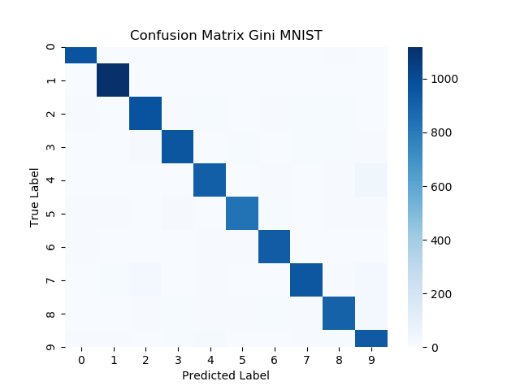

### Introduction

The authors of “Fashion-MNIST: a Novel Image Dataset for Benchmarking Machine Learning Algorithms” set out to create a dataset to rival the most widely used public dataset for machine learning, the MNIST dataset. They believe that the MNIST dataset, which is comprised of 7,000 pre-processed images of handwritten digits, is too simple of a machine learning task as accuracies of 99.7% can now be achieved. The Fashion-MNIST dataset is unique as it contains the same number of examples with the same image format along with the same number of possible classes as the MNIST dataset. Therefore, this new dataset can be easily integrated into any machine learning framework as most already support MNIST with included helper functions and examples. The paper to be investigated proves that the Fashion-MNIST dataset is more of a challenge to classify than the original MNIST dataset, achieving a maximum test accuracy of 89.7%. To do so, the authors present a number of machine learning algorithms, each with multiple examples using different parameter values, and present an average testing accuracy over 5 trials of randomly shuffled data for each classifier. The results are also compared to the corresponding benchmark accuracies for the MNIST dataset.

# Model

#### SVM
#### CNN
Given that the original authors, Xiao et al, never tested against any deep learning models, we decided this would be the perfect opportunity to test the core hypothesis of the paper. Convolutional neural networks (CNN) are well poised to tackle image classification problems such as Fashion-MNIST & MNIST. For the sake of simplicity, we made use of Tensorflow’s Keras package to import both datasets and build the LeNet-5 CNN architecture.

##### Procedure
* Import MNIST and Fashion-MNIST datasets
* Reshape and pad the data such that each sample can be properly passed to the CNN.
* Build and compile a LeNet-5 CNN for both datasets
* Train each model for 20 epochs while using 10% of the training data in validation split
* Evaluate each model

For a more in-depth look at how these steps were accomplished, feel free to take a look at our [interactive notebook](AdvML_LeNet5_test.ipynb).

##### Results
We made use of a 75/10/15 split for training, validation, and testing respectively.  After training each model for 20 epochs, we were able to achieve the following accuracies:

* Fashion-MNIST:
  * Test accuracy - 88.96%
  * Training accuracy - 96.37%
  * Validation accuracy - 89.97%
* MNIST:
  * Test accuracy - 98.83%
  * Training accuracy - 99.80%
  * Validation accuracy - 98.92%

From the above results, we see that the model performs worse on the Fashion-MNIST dataset than it does on the MNIST dataset. This confirms our hypothesis in which the CNN would do worse on Fashion MNIST. Our results also illustrate that neither model has overfit the data due to the relatively high validation accuracy in comparison to their respective test set accuracies.

#### Random Forest
In order to replicate the papers parameters for random forest we use a prebuilt Random Forest classifier from sklearn. We changed to corresponding parameters with the authors of the original paper.

##### Procedure
* Import MNIST and Fashion Mnist and pre-process data with numpy
* Train Random Forest with different parameters as seen in Table 1
* Test and Train model with Sklearn Ensemble
* Use Sklearn Accuracy_Score to evaluate performance

##### Results
 We ran each test five times and took an average of the accuracy of the model our results are show in Table 1 (WILL CREATE TABLE AND INSERT A TABLE):

	n_estimater | depth | criterion | acc MNIST Fashion | MNIST
       ------------ | ----- | --------- | ----------------- | -----
	     100    |  100  | gini      | 0.87582           | 0.9683
             100    |  50   | gini      | 0.87686           | 0.9696
             10     |  50   | gini      | 0.85342           | 0.9486
             100    |  10   | gini      | 0.84352           | 0.94858
             100    |  10   | entropy   | 0.84564           | 0.94999
             10     |  50   | entropy   | 0.85666           | 0.94878
             100    |  50   | entropy   | 0.877             | 0.9688
             100    |  100  | entropy   | 0.8775            | 0.9709
Table 1

We also visualized some methods with a confusion matrix to visually represent the models performance.

| Label | Description |
| --- | --- |
| 0 | T-shirt/top |
| 1 | Trouser |
| 2 | Pullover |
| 3 | Dress |
| 4 | Coat |
| 5 | Sandal |
| 6 | Shirt |
| 7 | Sneaker |
| 8 | Bag |
| 9 | Ankle boot |

# Discussion

# Conclusion
